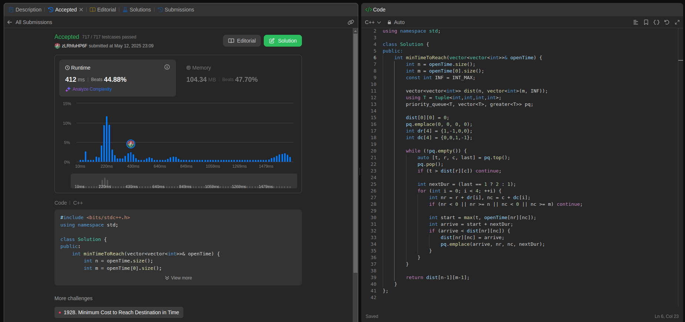
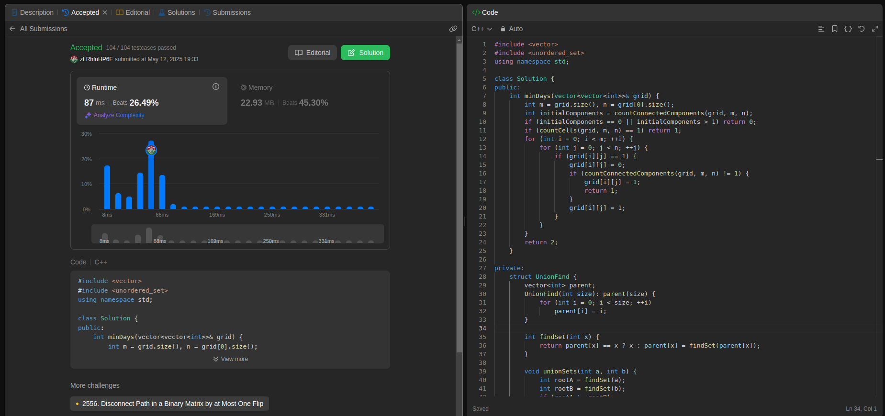
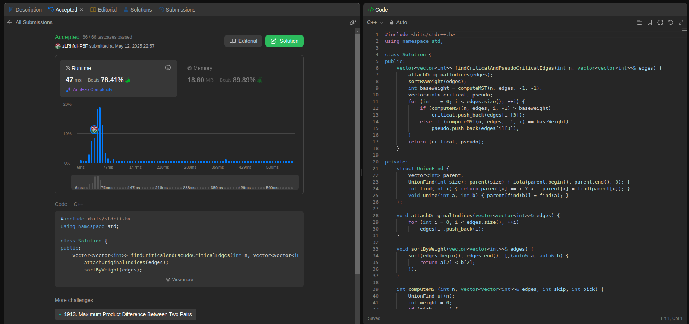
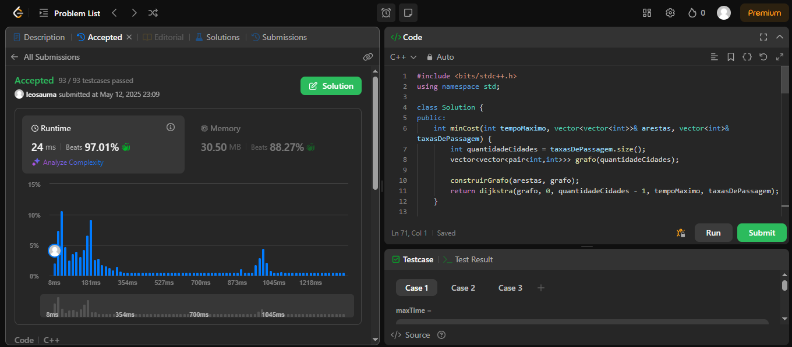

# Grafos2LeetCode
# Exercícios LeetCode

- **Número da Lista**: 2 <br>
- **Conteúdo da Disciplina**: Grafos 2 <br>
- [**Vídeo da Apresentação**](https://youtu.be/EKrA-cqyv6Q) <br>

## Alunos
|Matrícula | Aluno |GitHub|
| -- | -- | -- |
| 23/1035428  | Leonardo Henrique Sobral Sauma Junior |[leohssjr](https://github.com/leohssjr)|
| 23/1011426  | Gustavo Gontijo Lima |[Guga301104](https://github.com/guga301104)|

## Sobre 
Este repositório tem como objetivo a resolução de exercícios sobre grafos do [LeetCode](https://leetcode.com/), utilizando o conteúdo de Grafos 2 da disciplina Projeto de Algoritmos, sendo 1 de nível médio e 3 de nível difícil.

|Exercício | Dificuldade |
| -- | -- |
|[3342](https://leetcode.com/problems/find-minimum-time-to-reach-last-room-ii/description/)|🟡 Médio|
|[1568](https://leetcode.com/problems/minimum-number-of-days-to-disconnect-island/description/)|🔴 Difícil|
|[1489](https://leetcode.com/problems/find-critical-and-pseudo-critical-edges-in-minimum-spanning-tree/description/)|🔴 Difícil|
|[1928](https://leetcode.com/problems/minimum-cost-to-reach-destination-in-time/)|🔴 Difícil|

## Screenshots

### Exercício 1 - [Find Minimum Time to Reach Last Room II](https://leetcode.com/problems/find-minimum-time-to-reach-last-room-ii/description/)


- Dificuldade: 🟡 Média <br>
- Problema: [3342](https://leetcode.com/problems/find-minimum-time-to-reach-last-room-ii/description/) <br>
- [Resposta](questoes/leetCode_3342.cpp) <br>

### Exercício 2 - [Minimum Number of Days to Disconnect Island](https://leetcode.com/problems/minimum-number-of-days-to-disconnect-island/description/)


- Dificuldade: 🔴 Difícil <br>
- Problema: [1568](https://leetcode.com/problems/minimum-number-of-days-to-disconnect-island/description/) <br>
- [Resposta](questoes/leetCode_1568.cpp) <br>

### Exerício 3 - [Find Critical and Pseudo Critical Edges in Minimum Spanning Tree](https://leetcode.com/problems/find-critical-and-pseudo-critical-edges-in-minimum-spanning-tree/description/)


- Dificuldade: 🔴 Difícil <br>
- Problema: [1489](https://leetcode.com/problems/find-critical-and-pseudo-critical-edges-in-minimum-spanning-tree/description/) <br>
- [Resposta](questoes/leetCode_1489.cpp) <br>

### Exercício 4 - [Minimum Cost to Reach Destination in Time](https://leetcode.com/problems/minimum-cost-to-reach-destination-in-time/description/)


- Dificuldade: 🔴 Difícil <br>
- Problema: [1928](https://leetcode.com/problems/minimum-cost-to-reach-destination-in-time/description/) <br>
- [Resposta](questoes/leetCode_1928.cpp) <br>

## Instalação 
**Linguagem**: C++
- Para os testes e julgamentos automáticos, os códigos devem ser executados no LeetCode.

## Uso 
Para cada código, deve-se:
- 1: Copiar o codigo do arquivo ```*.cpp``` disponível nesse repositório.
 
- 2: Entrar no site do LeetCode para o problema da questão.

- 5: Alterar a linguagem para ```C++``` caso esteja em outra linguagem.
 
- 6: Colar o código na área destinada para a resposta.
 
- 7: Clicar em ```Run``` para testar os casos básicos.

- 8: Clicar em ```Submit``` para receber o resultado de aprovação do código.
  
## Vídeo da Apresentação
Acesse o vídeo de explicação das resoluções [clicando aqui](https://youtu.be/EKrA-cqyv6Q).
